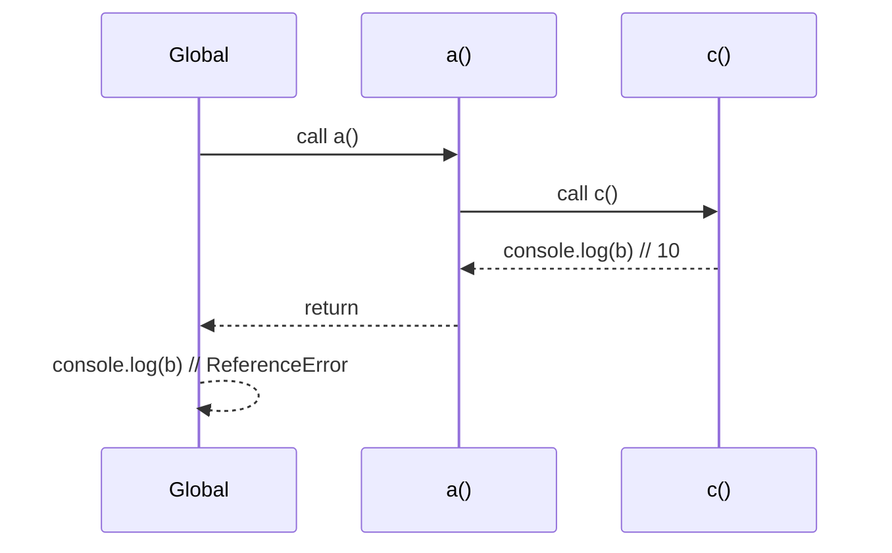

## Scope and Hoisting

### Scope

🔍 What is Scope?

Scope determines where variables can be accessed in your code. Think of it like different rooms in a house - some things are accessible everywhere (living room), some only in specific rooms (bedroom closet).

📍 Types of Scope

Global Scope

Variables declared outside any function or block are globally accessible:

```js
let globalVariable = "I'm global";

function test() {
  console.log(globalVariable); // Accessible everywhere
}
```

Function Scope

Variables declared inside functions are only accessible within that function:

```js
function myFunction() {
  var functionScoped = "Only accessible here";
  console.log(functionScoped); // Works
}
// console.log(functionScoped); // ReferenceError
```

Block Scope

Variables declared with let and const inside {} are block-scoped:

these were introduced in es6+ along with let and const keyword for variable declaration

```js
if (true) {
  let blockScoped = "Only in this block";
  const alsoBlockScoped = "Me too!";
}
// console.log(blockScoped); // ReferenceError
```

### var vs let vs const

var vs let vs const

all three are keyword for variable declaration

|             | var                                                                   | let                                                                                                                             | const                                                                                                                             |
| ----------- | --------------------------------------------------------------------- | ------------------------------------------------------------------------------------------------------------------------------- | --------------------------------------------------------------------------------------------------------------------------------- |
| About       | it is oldest way of variable delcaration and rapidely used before es6 | it was introduced in es+                                                                                                        | it was also introduced in es+                                                                                                     |
| Redeclare?  | can be redclared                                                      | variables delcared with let keyword cannot be redeclared                                                                        | variables delcared with const keyword cannot be redefined or redclared                                                            |
| Reassigned? | can be reassigned                                                     | can be reassigned                                                                                                               | cannot be reassigned                                                                                                              |
| Scope       | these are functionally scoped                                         | these are functionally + blocked scoped                                                                                         | these are functionally + blocked scoped                                                                                           |
| Hoisting    | var delcaration are hoisted but initialized with undefined            | let declaration are hoisted but not initialized they stay in temporal dead zone which gives ReferenceError if tried to accessed | const declaration are hoisted but not initialized they stay in temporal dead zone which gives ReferenceError if tried to accessed |

### Hoisting

Hoisting:Hoisting is JavaScript's behavior of moving declarations to the top of their scope during compilation.
Its working is totally defined by js working like how it allocates memory for all the variables and initialize
undefined for var,
dont initialize for let const "temporal dead zone"
and functions are fully hoisted in memory block(environment variables)

Variable Hoisting:

var declarations are hoisted but initialized as undefined

let and const are hoisted but not initialized (Temporal Dead Zone)

```js
console.log(hoistedVar); // undefined (not error)
var hoistedVar = "Hello";
```

```js
console.log(hoistedLet); // ReferenceError
let hoistedLet = "World";
```

Function Hoisting:

Function declarations are fully hoisted

Function expressions are not hoisted

```js
// Works - function declaration hoisted
sayHello(); // "Hello!"

function sayHello() {
  console.log("Hello!");
}
```

```js
// Doesn't work - function expression not hoisted
sayBye(); // TypeError
var sayBye = function () {
  console.log("Bye!");
};
```

### Temporal Dead Zone (TDZ)

The period between a `let`/`const` declaration being hoisted and its first assignment. During the TDZ, accessing the variable throws a `ReferenceError`.

```js
console.log(a); // undefined (var is hoisted and initialized)
console.log(b); // ReferenceError (TDZ)
var a = 1;
let b = 2;
```

### Variable Shadowing

Variable Shadowing: When a variable in an inner scope has the same name as one in an outer scope, the inner one "shadows" the outer.

```js
let x = 10;
function demo() {
  let x = 20; // Shadows global x
  console.log(x); // 20
}
demo();
console.log(x); // 10
```

⚠️ Shadowing is allowed with let/const but illegal if it creates conflict with var inside same scope type.

```js
function test() {
  var x = 10;
  let x = 20; // ❌ SyntaxError: Identifier 'x' has already been declared
}
```

👉 Rule of thumb:

Shadowing is fine if variables belong to different scopes.

Shadowing is illegal if var tries to shadow let or const in the same function/block scope.

### Lexical Scope (Static Scope)

Lexical scope means a function’s scope is determined by where it is defined, not where it is called. Variable lookup proceeds outward through enclosing scopes until the global scope.

```js
function outer() {
  const outerVar = "Outer";

  function inner() {
    console.log(outerVar); // ✅ Resolved from the outer lexical environment
  }

  return inner;
}

const fn = outer();
fn(); // "Outer"
```

If a variable cannot be found in the current scope, the engine searches the next outer scope, and so on, up to the global scope. If still not found, a ReferenceError is thrown.

### Call Stack and Lexical Scope — Example

```js
function a() {
  var b = 10;
  c();
  function c() {
    console.log(b); // 10 (resolved via lexical scope)
  }
}

a();
console.log(b); // ReferenceError: b is not defined
```

### Diagram: Execution Flow (Call Stack)



### Diagram: Stack Frames Push/Pop

```mermaid
graph TD
    G[Global EC] -->|invoke a()| A[a EC]
    A -->|invoke c()| C[c EC]
    C -->|finish| A
    A -->|finish| G
```

Key points:

- A new Execution Context (EC) is created and pushed onto the call stack every time a function is invoked.
- Each EC has a lexical environment that references its outer (parent) environment.
- Identifier lookup walks outward through these references (inner → outer → global).
  ###- The process of lookig outward is called scope chain
- When a function finishes, its EC is popped from the call stack.
